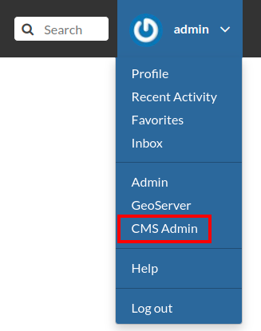

# Cartoview CMS
This a [Wagtail + CodeRed](https://github.com/coderedcorp/coderedcms) based Content Management System app for Cartoview.

## Include the app in existing Cartoview
In the following steps, we shall describe how to add this CMS app to a previously installed Cartoview.

1. Navigate to the **Manage Apps** page in your cartoview. It should be at [http://localhost:8000/cv_apps/manage/](http://localhost:8000/cv_apps/manage/) and install the app.
2. After restarting the cartoview instance, you should find the app in the apps' list at [http://localhost:8000/cv_apps/](http://localhost:8000/cv_apps/), and you can access the CMS admin panel at [http://localhost:8000/cv_apps/cartoview_cms/admin/](http://localhost:8000/cv_apps/cartoview_cms/admin/).

## CMS configuration
In these steps, we will integrate the CMS into Cartoview's navbar and footer, so we can have control over the menu items.

> 📝 The latest version currently of Cartoview is the one that will be referenced which is [v1.33.1](https://github.com/cartologic/cartoview/tree/v1.33.1).

Navigate to the [geonode_base.html](https://github.com/cartologic/cartoview/blob/v1.33.1/cartoview/templates/geonode_base.html) in your cartoview installation and add the header block imported from GeoNode's [base.html](https://github.com/GeoNode/geonode/blob/3.3.1.post1/geonode/templates/base.html#L302-L495) template.
> 📝 The whole header is imported to be able to change the menu items and the admin dropdown.

Load the following CMS template tags in the beginning of **geonode_base.html** and **cartoview/footer.html**.
```django

```

### Add CMS menu items to Cartoview's menu
Search for **extra_tab** block which should be at the imported header then add the following code snippet inside it. This will show the menu items created in the CMS after GeoNode's items.
```django

    
    
        
            
         
    

```

If you want to replace GeoNode's menu items, remove all the code in the **tabs** block then add the snippet above.

### Add (CMS Admin) link to admin dropdown
Search for **GeoServer**, you should find a snippet like the one below.
```django

    <li><a href="{{ OGC_SERVER.default.WEB_UI_LOCATION }}">GeoServer</a></li>

```

Under that snippet, add the following one.
```django

    <li><a href="">CMS Admin</a></li>

```

You should now find the CMS Admin link in the dropdown as the image below.



### Add CMS menu items to Cartoview's footer
Navigate to the **footer.html** that should be in the directory `templates/cartoview/` and add the following code snippet after [the div of footer_column_3 block](https://github.com/cartologic/cartoview/blob/v1.33.1/cartoview/templates/cartoview/footer.html#L68).
```django

    
    
        
            <div class="col-md-2">
                <ul class="list-unstyled">
                    
                </ul>
            </div>
        
    

```

The CMS menu items now should be included in the GeoNode's site map.